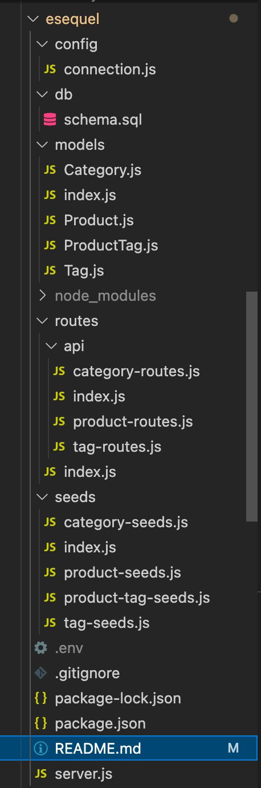
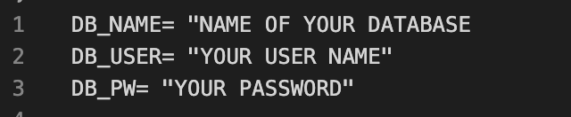
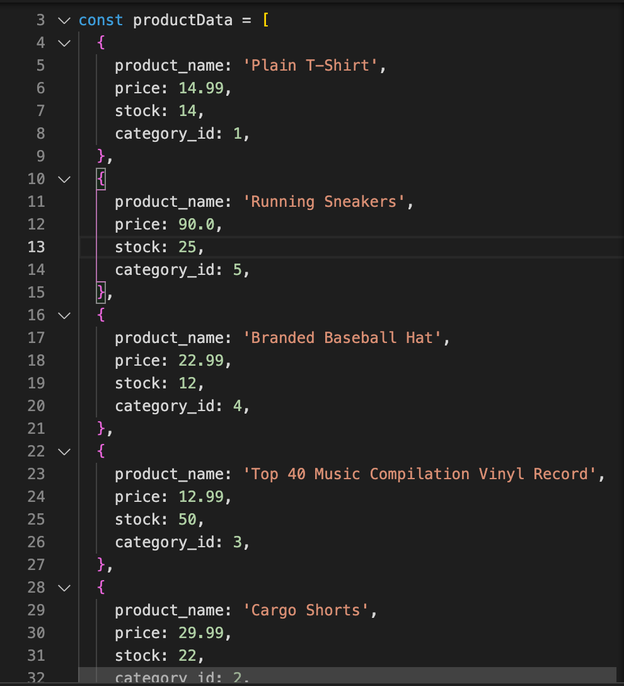
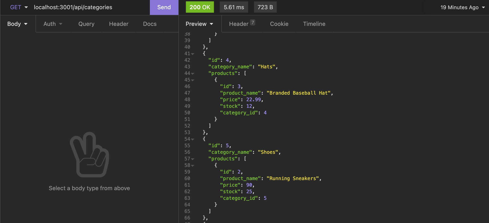

# esequel

## Description

E-Sequel uses the latest back-end technologies in order to build a database that allows the user to Creat, Read, Update and Delete different inventory for their e-commerce website.

## Table of Contents

- [Installation](#installation)
- [Usage](#usage)
- [Technology](#technology)
- [Tests](#tests)
- [Questions](#questions)
- [License](#license)

## Installation

1. `Git clone` my repository

2. Your file structure should resemble the follow:

3. Create a .env file at the root and input your own database information as follows:

4. On the command line, in the root of the directory type `npm install`.

5. Make sure that package.json, package-lock.json and node_modules are all properly displaying

6. Create the database by signing into MySql (`mysql -u root -p`) and run: `source db/schema.sql;`

7. Run `npm run seed` to seed the data to the database.

8. `npm start` to run the server on `localhost:3001`

9. Use `Insomnia` in order to test the api routes:

   - `/api/categoires`
   - `/api/products`
   - `/api/tags`

## Usage

Please see attached [video](https://drive.google.com/file/d/1FQPOqr2RSM_eux22UpoFSY3gW1Hz_NWE/view?usp=sharing) on how to use this application!

## Technology

- Express package
- mysql2 package
- sequelize package
- dotenv package

## Tests

You can update the `seeds.sql` file in order to update your current e-commerce website's inventory:

One you are satisfied with the update information in the `seeds.sql` file, then run `mysql -u root -p` in terminal:

- Run `source db/schema.sql`
- **Quit** and then run `npm run seed` and your update inventory will be seeded to the database

Use Insomnia and Create, Read, Update or Delete in api routes :

## Questions

Hi my name is [DiSantoz](https://github.com/DiSantoz) the developer behind e-sequel !

If you have any questions about the usage of this project or any suggestions on how to better this project please feel free to contact me at:

dferreira91@outlook.com

## License

MIT License

Copyright (c) 2021 DiSantoz

Permission is hereby granted, free of charge, to any person obtaining a copy
of this software and associated documentation files (the "Software"), to deal
in the Software without restriction, including without limitation the rights
to use, copy, modify, merge, publish, distribute, sublicense, and/or sell
copies of the Software, and to permit persons to whom the Software is
furnished to do so, subject to the following conditions:

The above copyright notice and this permission notice shall be included in all
copies or substantial portions of the Software.

THE SOFTWARE IS PROVIDED "AS IS", WITHOUT WARRANTY OF ANY KIND, EXPRESS OR
IMPLIED, INCLUDING BUT NOT LIMITED TO THE WARRANTIES OF MERCHANTABILITY,
FITNESS FOR A PARTICULAR PURPOSE AND NONINFRINGEMENT. IN NO EVENT SHALL THE
AUTHORS OR COPYRIGHT HOLDERS BE LIABLE FOR ANY CLAIM, DAMAGES OR OTHER
LIABILITY, WHETHER IN AN ACTION OF CONTRACT, TORT OR OTHERWISE, ARISING FROM,
OUT OF OR IN CONNECTION WITH THE SOFTWARE OR THE USE OR OTHER DEALINGS IN THE
SOFTWARE.
